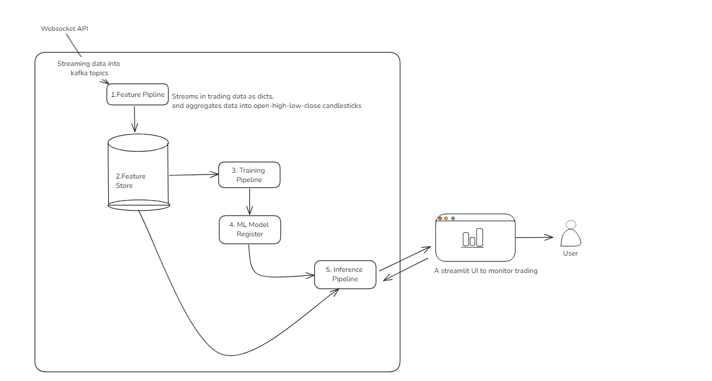

## A servless machine learning pipeline that predicts crypto changes over short term

## Current Status

### Feature Pipeline
- **Trade Producer Microservice**: Runs locally and within Docker containers
- **Trade to OHLC Conversion**: Currently runs locally. Dockerization will be implemented after configuration adjustments.

### Data Management
- **OHLC Data Storage**: The process to store OHLC data in the Hopsworks Feature Store needs to be addressed and API 