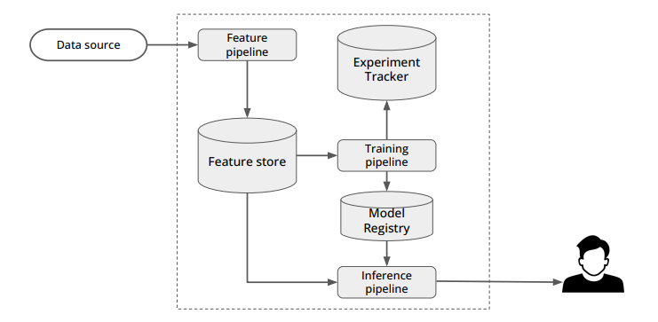

## Servless machine learning pipeline for real-time classification and short-term momentum trading for currency pairs

![ML Pipeline plan]
Fig 1. Schema of pipeline components. Data Source is a websocket or restapi from Kraken. Feature pipeline includes three microservices (trade_producer, trade_to_ohlc, kafka_to_feature_store). 

## Current Status

Needs doing:
[X] - Fixing both the feature_pipeline.yml and backfill_pipeline.yml dependancies and integrate them with dev and local settings
[X] - Fix historical timestamp issue for trade_to_ohlc 

### Feature Pipeline
- **Trade Producer Microservice**: Runs locally and within Docker containers
- **Trade to OHLC Conversion**: Runs locally and within Docker containers for live. NOTE: FIX Timestamp issue for historic pipeline. In historical pipeline, the timestamps for candlesticks is not the one that corresponds to their historic timestamp. It's the latest timestamp. 
- **Kafka to Hopsworks**: Runs locally. Test with makefiles and dev

### Data Management
